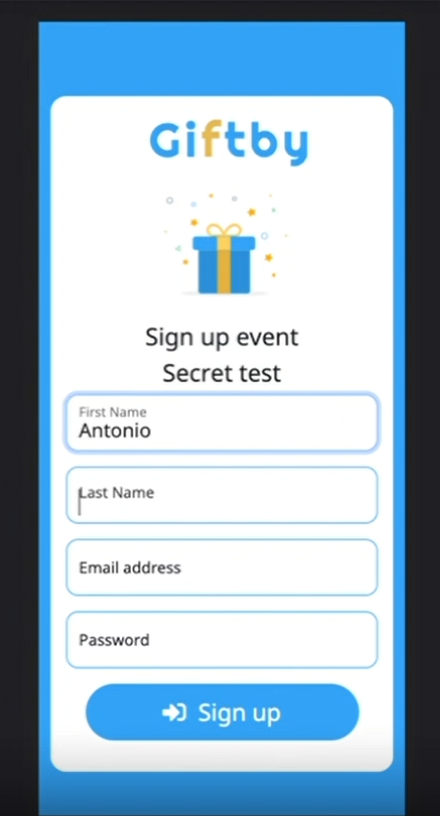
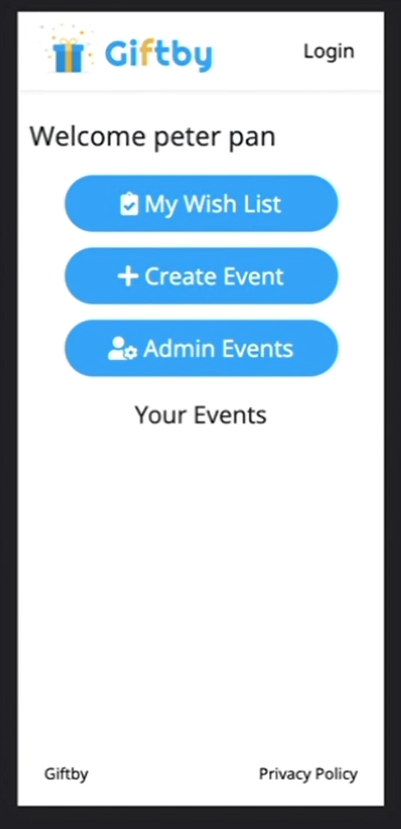

# Giftby
"A Secret Santa gift exchange app"


<br />

 <br />

## Table of Contents 

- [Description](#description)
- [Usage](#usage)
- [Screenshots](#screenshots)
- [Deployed](#deployedapplicationlink)
- [Languages](#languages)
- [License](#license)
- [Contributers](#contributers)

<br />

## Deployed Application Link
<br/>

[Giftby](https://secret-santa-project.herokuapp.com/)

<br />

## Description

This application will help you, your friends and/or family create a secret santa system to randomly pass gifts to each other.
<br />

## Usage

 <br />

To run the application, type the link below:
```
https://the-giftby.herokuapp.com/
```
## Screenshots

What the app on the web looks like:

<p align="center"></p> <br /> 

<p align="center"></p> <br /> 


## Languages and Technologies

JavaScript, CSS, Bootstrap v5, Animate.JS, LottieFiles, Google Fonts, Material Icons, Node, Dotenv, Express, Express-handlebars, Inquirer, mysql2, Bcrypt, Express-session, MomentJS, Connect-session-sequelize,Nodenom, Nodemailer<br />


## License

This project is licensed under the MIT license. <br />

## Contributers 

- [SivanKaplan](https://github.com/sivanagar)
- [JoseVelasquez](https://github.com/joseduardo15062005)
- [GokulKowligi](https://github.com/gkowligi1392)
- [AntonioHuerta](https://github.com/Tonycodesnows)
